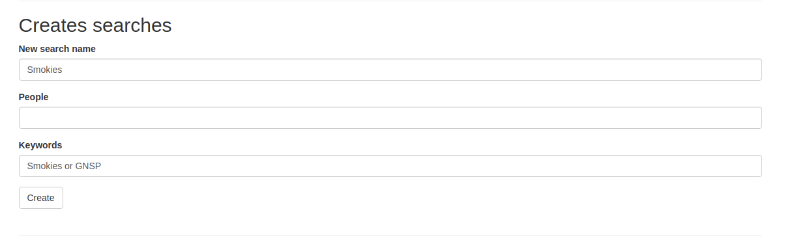

# Simple photo gallery and slideshow with facial recognition


## Description
A flask app that provides state of the art computer vision capabilities combined with a slideshow.

Uses Flask backend with SLQAlchemy over Sqlite3. 

## Capabilities
  * Work from local files
  * Detect faces in all photos using MTCNN
  * Create facial embeddings using Arcface (over 20% more accurate on open set accuracy than Dlib on personal data sets)
  * Supports manual labeling of faces for creating galleries ("training")
  * Assigns labels for unknown faces using radius neighbors classifier
  * Supports searching by people
  * Supports searching by keywords in original path
  * Runs slideshows based on search results
  
## Todo

  * Add metadata extraction and search
  * Add object recognition and search
  * Add scene recogntiion and search 
  
## Acknolwedgments and citations
Backend is modeled heavily on Miguel Grinberg's Flask Megatutorial: https://github.com/miguelgrinberg/microblog

Front end combines bootstrap, konvas.js and galleria.js

Imports the facenet-pytorch implementation of MTCNN: https://github.com/timesler/facenet-pytorch
Pretrained Arcface model is extracted from https://github.com/foamliu/InsightFace-v2


## Installation/running

### Local installation with git/conda
Requires redis server running locally.

Clone repo<br>
```
git clone https://github.com/zack-kimble/photo_gallery.git
cd photo_gallery
```

Set up and activate conda environment <br>
```
conda env create -f conda_environment.yaml
conda activate photo_gallery
```

Run server
`
flask run
`

Run rq queue and workers
`rq worker photo-gallery-tasks`
### Local docker container

Clone repo<br>
```
git clone https://github.com/zack-kimble/photo_gallery.git
cd photo_gallery
```

Optional, build container locally
`docker-compose build`

Launch server
`docker-compose up`

On MacOs you can also just double click run_photo_gallery.command


## User instructions

### Basic operation

First add photos by copying and pasting an absolute path into the "path for photo directory box"


At this point, you can search these files by entering a search name and a criteria in keywords form. Basic boolean operators are supported (and/or/not). Commas are interpretted as "and". Words seperated by spaces are treated as phrases. Ie, Zack Kimble will be searched as an entire phrase. Quotes are not supported.



Adding no criteria to a search will return all images, which can be useful at times.


Searches can be run by selecting a search and an ordering then hitting 'slideshow'. Currently only random ordering is supported. The "use cache" checkbox will use the previously returned results for a search if avaialbe. (saves time on complicated searches)


### Facial recognition

Once you have added photos via the "add photos" form, click "detect". This will launch a background task to detect faces in all photos. You can track progress by looking at "tasks" at the bottom of the page.

Once detection is complete, faces can be embedded by clicking the "embed" button.

Once embedding is complete, you will need to label some faces. These faces will be used as "gallery" images by the facial recognition process. Other photos that are similar enough to these will be labeled the same way. More is better. None of these labels are uploaded to any external apis.

To label photos, first select a search to limit the files you want to label. Then select "Label".

A page will open that shows boxes around detected faces and the names assosciated. All will currently say "None".


Double click the label and write in the name of the person in the square. Changes are immediately saved. Do this for at least 8-12 images of a given individual.

On the home page, click identify. This will launch a background task to identify photos of that person. Once complete, you can create searches using the "people" criteria which will use both manual and automatic labels. Boolean logic support is the same as for keywords.

## Updating

Existing docker installation can be updated by running update_photo_gallery.command.